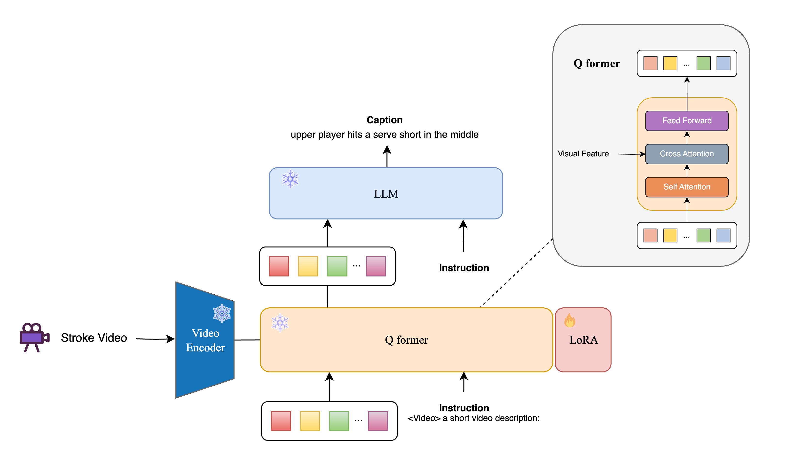
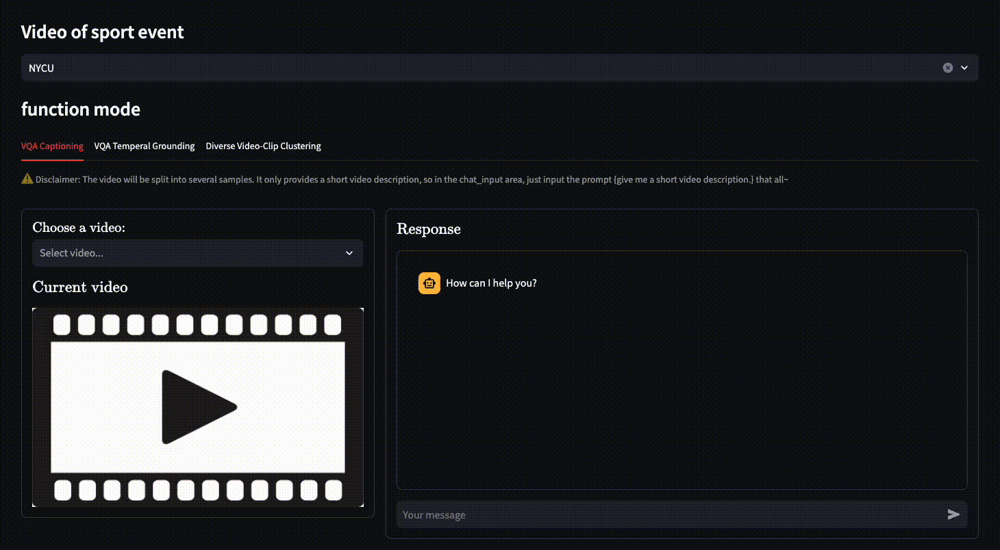
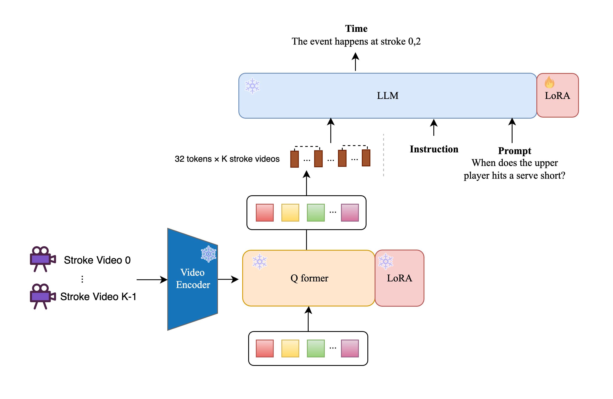
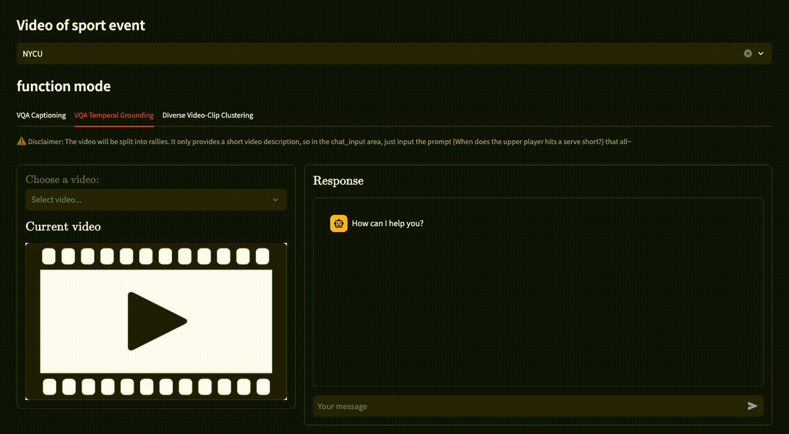

# Precision Sport Science Project LLM Video Summary
## Overview


This project introduces a semantic retrieval system for badminton match videos using a large language model (LLM). The system addresses limitations in traditional video retrieval methods by improving semantic understanding and temporal localization. It employs a two-stage training process:


<p align="center">Figure 1. Overview of our model for event localization in videos.</p>

### Stage 1: Q-former Pretraining
- **Objective**: Train cross-modal mapping between vision and language.
- **Method**: Video captioning task to pretrain the Q-former module.
- **Efficiency**: LoRA technology enhances training efficiency with minimal parameter adjustments.


<p align="center">Figure 2. Single-stroke captioning stage to align visual and text features.</p>

#### Captioning Demo


### Stage 2: LLM Fine-tuning
- **Objective**: Enhance video semantic temporal localization.
- **Method**: Video QA task to map natural language queries to video events.
- **Efficiency**: LoRA reduces resource consumption for large-scale parameter updates.


<p align="center">Figure. 3: Multi-stroke Video QA training for temporal grounding.</p>

#### Temporal Grounding Demo


## Content

- [Installation](#installation)
- [Citation](#citation)
- [Acknowledgement](#acknowledgement)

## Installation

### Install Code

1. Clone repo.

```bash
git clone https://github.com/aiden1020/PrecisionSport_InstructBLIP
```

2. Install packages

```bash
pip install -r requirements.txt
```
3. Generate Dataset

check it from (PrecisionSportDataset)
https://github.com/aiden1020/PrecisionSportDataset

### Experiment ID

|                                        | r = 1 | r = 2 | r = 4 | r = 8 |
| -------------------------------------- | ----- | ----- | ----- | ----- |
| Q-Former LoRA (cross-attn, FlanT5-XL)  | 1     | 2     | 3     | 4     |
| Q-Former LoRA (all, FlanT5-XL)         | 5     | 6     | 7     | 8     |
| Q-Former LoRA (cross-attn, Vicuna-7b)  | 9     | 10    | 11    | 12    |
| Q-Former LoRA (all, Vicuna-7b)         | 13    | 14    | 15    | 16    |

### Run script

For example, if you want to try experiment 1 for badminton_caption, you can use this command.

```bash
bash run_scripts/instructblip/train/run_finetune_instructblip_experiments.sh badminton_caption 1
```

### Inference

For visual question answering (VQA) inference, please refer to the [`inference_vqa.ipynb`](./inference_vqa.ipynb) notebook. This notebook provides examples for both single and batch inference on video clips. It demonstrates how to:
- Load a trained model.
- Process video clips and prepare them for the model.
- Formulate questions about video content.
- Get answers from the model, including temporal localization of events.

## Video Analysis and Diversity Sampling

In addition to semantic retrieval, this project includes a powerful pipeline for video analysis and diversity sampling. This pipeline leverages the trained models to first retrieve relevant clips based on natural language queries and then selects a diverse subset for detailed analysis.

For a detailed explanation of this pipeline, please see the [Diversity README](./diversity/README.md).

### Key Features
- **Intelligent Video Retrieval**: Uses the InstructBLIP model for VQA-based retrieval of clips.
- **Feature Extraction**: Employs a TC-CLIP encoder to generate feature vectors for videos.
- **Diversity Sampling**: Implements a farthest-first algorithm to select a diverse set of clips.
- **Analysis and Visualization**: Provides tools to compare diversity sampling against random sampling, including PCA plots and statistical reports.

To run this pipeline, you can use the `run_pipeline.py` script:
```bash
torchrun --nproc_per_node=<num_gpus> run_pipeline.py
```

## Citation
```bibtex
@inproceedings{kim2024towards,
  title={Towards Efficient Visual-Language Alignment of the Q-Former for Visual Reasoning Tasks},
  author={Kim, Sungkyung and Lee, Adam and Park, Junyoung and Chung, Andrew and Oh, Jusang and Lee, Jay-Yoon},
  booktitle={Findings of the Association for Computational Linguistics: EMNLP 2024},
  pages={15155--15165},
  year={2024}
}
```

## Acknowledgement

- [@Lightning-AI](https://github.com/Lightning-AI) for [lit-llama](https://github.com/Lightning-AI/lit-llama)
- [@FacebookResearch](https://github.com/facebookresearch) for the original [LLaMA implementation](https://github.com/facebookresearch/llama)
- [@Salesforce](https://github.com/salesforce) for [LAVIS](https://github.com/salesforce/LAVIS)
- [@InstructBLIP_PEFT](https://github.com/AttentionX/InstructBLIP_PEFT)

## License

[BSD 3-Clause License](LICENSE.txt) (from LAVIS)

[Apache 2.0 License](LICENSE) (From lit-llama)
