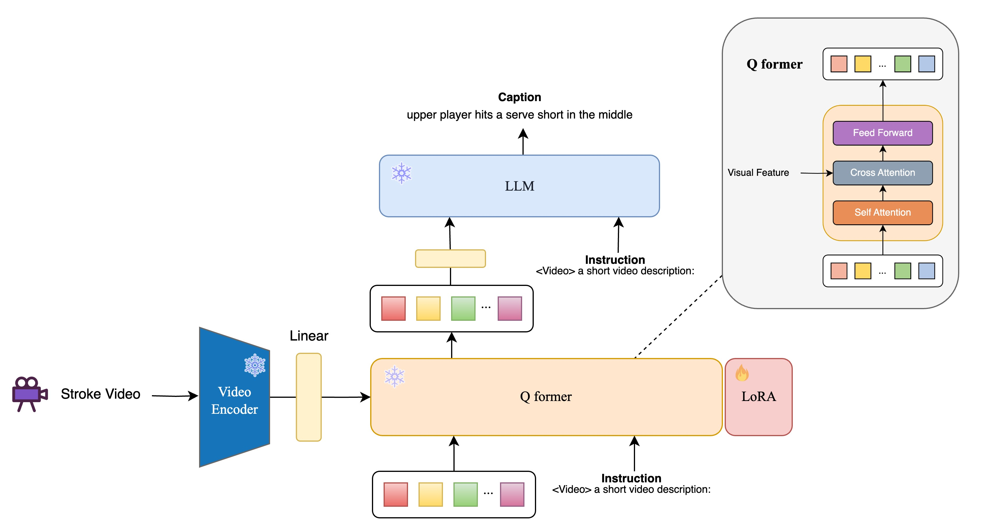
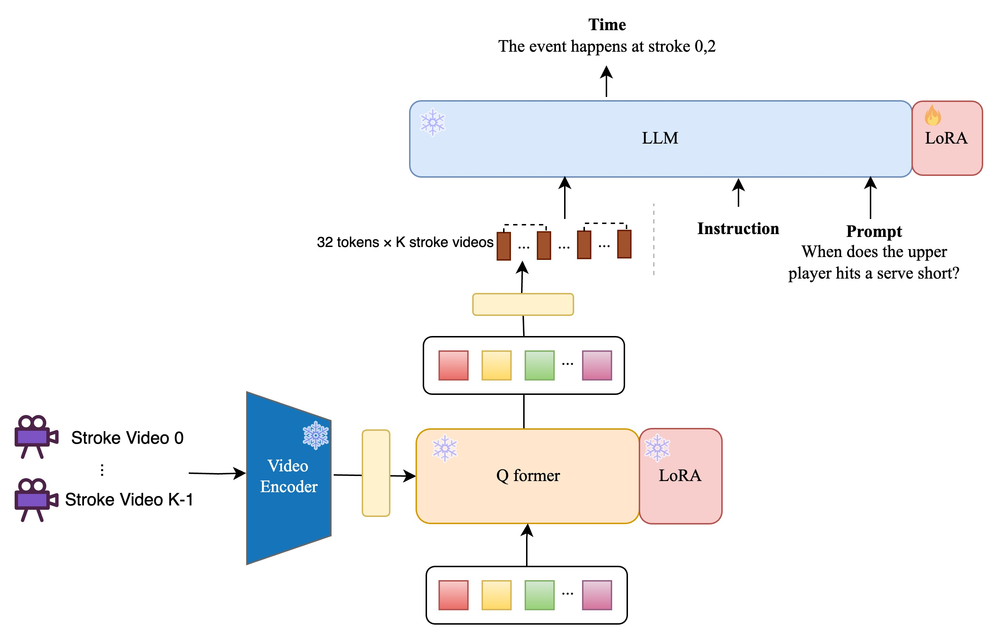

# Precision Sport Science Project LLM Video Summary
## Overview


This project introduces a semantic retrieval system for badminton match videos using a large language model (LLM). The system addresses limitations in traditional video retrieval methods by improving semantic understanding and temporal localization. It employs a two-stage training process:


<p align="center">Figure 1. Overview of our model for event localization in videos.</p>

### Stage 1: Q-former Pretraining
- **Objective**: Train cross-modal mapping between vision and language.
- **Method**: Video captioning task to pretrain the Q-former module.
- **Efficiency**: LoRA technology enhances training efficiency with minimal parameter adjustments.


<p align="center">Figure 2. Single-stroke captioning stage to align visual and text features.</p>

### Stage 2: LLM Fine-tuning
- **Objective**: Enhance video semantic temporal localization.
- **Method**: Video QA task to map natural language queries to video events.
- **Efficiency**: LoRA reduces resource consumption for large-scale parameter updates.


<p align="center">Figure. 3: Multi-stroke Video QA training for temporal grounding.</p>

## Content

- [Installation](#installation)
- [Citation](#citation)
- [Acknowledgement](#acknowledgement)

## Installation

### Install Code

1. Clone repo.

```bash
git clone https://github.com/aiden1020/PrecisionSport_InstructBLIP
```

2. Install packages

```bash
pip install -r requirements.txt
```

### Experiment ID

|                                        | r = 1 | r = 2 | r = 4 | r = 8 |
| -------------------------------------- | ----- | ----- | ----- | ----- |
| Q-Former LoRA (cross-attn, FlanT5-XL)  | 1     | 2     | 3     | 4     |

3. Generate Dataset

check it from (PrecisionSportDataset)
https://github.com/aiden1020/PrecisionSportDataset
### Run script

For example, if you want to try experiment 1 for badminton_caption, you can use this command.

```bash
bash run_scripts/instructblip/train/run_finetune_instructblip_experiments.sh badminton_caption 1
```

## Citation
```bibtex
@inproceedings{kim2024towards,
  title={Towards Efficient Visual-Language Alignment of the Q-Former for Visual Reasoning Tasks},
  author={Kim, Sungkyung and Lee, Adam and Park, Junyoung and Chung, Andrew and Oh, Jusang and Lee, Jay-Yoon},
  booktitle={Findings of the Association for Computational Linguistics: EMNLP 2024},
  pages={15155--15165},
  year={2024}
}
```

## Acknowledgement

- [@Lightning-AI](https://github.com/Lightning-AI) for [lit-llama](https://github.com/Lightning-AI/lit-llama)
- [@FacebookResearch](https://github.com/facebookresearch) for the original [LLaMA implementation](https://github.com/facebookresearch/llama)
- [@Salesforce](https://github.com/salesforce) for [LAVIS](https://github.com/salesforce/LAVIS)
- [@InstructBLIP_PEFT](https://github.com/AttentionX/InstructBLIP_PEFT)

## License

[BSD 3-Clause License](LICENSE.txt) (from LAVIS)

[Apache 2.0 License](LICENSE) (From lit-llama)
